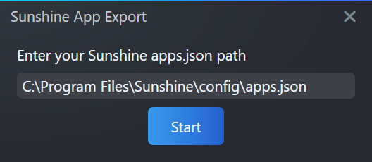

# SunshineAppExport

This is a [Playnite](https://github.com/JosefNemec/Playnite) addon that creates custom [Sunshine](https://github.com/LizardByte/Sunshine) apps from the currently selected games in Playnite.

Once imported, you can launch them from [Moonlight](https://github.com/moonlight-stream). It even imports your Playnite box art.

By default it will look for Sunshine's `apps.json` file at `C:\Program Files\Sunshine\config\apps.json`, but if you have a custom Sunshine install directory, the addon will ask you if you want to change where it looks for `apps.json`. 

